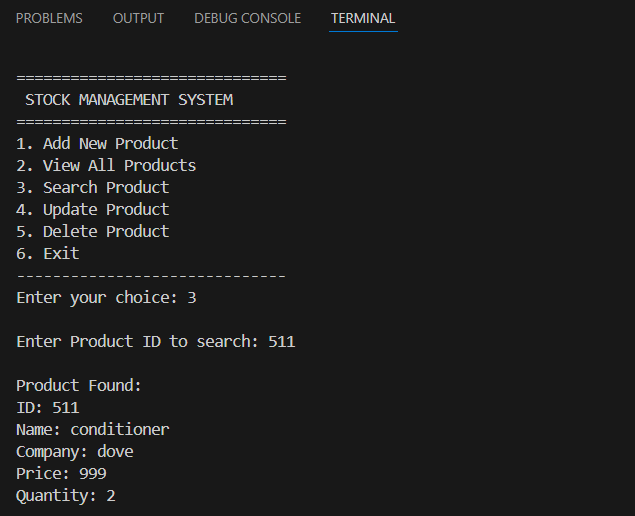
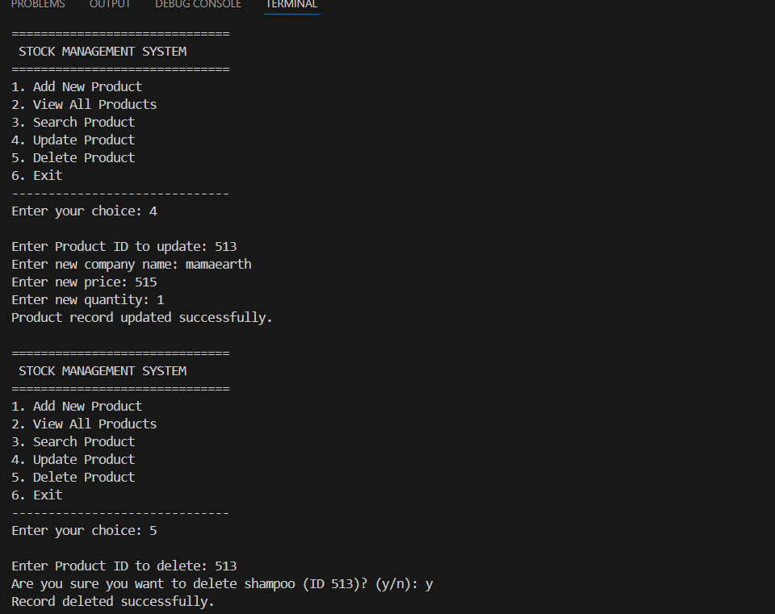

# Stock Management System

## Introduction

The Stock Management System is a console-based application developed in C to streamline inventory operations for small businesses and academic purposes. The system allows users to maintain records of products efficiently, focusing on reliability and ease of use.

## Purpose

This project demonstrates core C programming concepts—including structures, file handling, and modular design—while addressing a real-world need: systematic and error-free management of inventory stock.

## Features

### Add Product

Allows the user to enter all details of a new product (ID, name, company, price, quantity) and saves it to the data file. Duplicate IDs are checked to ensure accuracy.

### View Products

Displays a list of all products in a tabular format, enabling users to review current inventory at any time.

### Search Product

Supports quick lookup by product ID, letting users find item details instantly and reducing time spent searching records.

### Update Product

Gives users the ability to modify existing product information (company, price, quantity) as inventory changes occur.

### Delete Product

Removes unwanted or outdated products from inventory, helping keep records up to date. Confirmation is requested before deletion.

## Programming Requirements

- ANSI C standard
- Use of structs and arrays for data storage
- File operations (`fopen`, `fread`, `fwrite`) to ensure info persists after program exits
- Modularized code for each operation (add, view, search, update, delete)
- Does not require external libraries

## How To Use

1. Compile the program:
    ```bash
    gcc stock_management_system.c -o stock_management_system
    ```
2. Run it in the terminal:
    ```bash
    ./stock_management_system
    ```
3. Use the on-screen menu to add, view, update, search, or delete products.

## Menu Sample

```
==== Stock Management System ====
1. Add Product
2. View Products
3. Search Product
4. Update Product
5. Delete Product
6. Exit
Enter your choice:
```
## Output Screenshots

> After running the program, capture console windows as images and place them in a `screenshots/` folder in your repository.  
> Update the filenames below if you use different names.

### Main Menu Output


This screenshot shows the initial text-based menu with options to add, view, search, update, delete products, and exit the program.

### Add Product Output


This screenshot displays the console prompts and user input while adding a new product (ID, name, company, price, quantity) and the success message after saving.

### View Products Output


This screenshot shows the tabular listing of all products currently stored in `stock.dat`, including their IDs, names, companies, prices, and quantities.

### Search Product Output



This screenshot shows the input of a product ID and the corresponding product details displayed when the item is found.

### Update/Delete Output (Optional)



This screenshot captures updating or deleting a product, including the confirmation message and the updated table/record status.

## Technical Details

### Data Structure

The program uses a `Product` struct to represent each item:

```c
typedef struct {
    int id;
    char name[MAX_NAME_LEN];
    char company[MAX_COMPANY_LEN];
    int price;
    int quantity;
} Product;
```

### File Handling

- Binary file I/O with `fopen("rb")`, `fwrite()`, `fread()`
- Data persists across program sessions in `stock.dat`
- Efficient storage and retrieval of product records

### Key Functions

- `addProduct()` – Add a new product with duplicate ID check
- `viewProducts()` – Display all products in table format
- `searchProduct()` – Find a product by ID
- `updateProduct()` – Modify product details
- `deleteProduct()` – Remove a product with confirmation
- `saveProduct()` – Save single product to file
- `loadProducts()` – Load all products from file into memory
- `writeAllProducts()` – Write all products back to file
- `idExists()` – Check if product ID already exists

## Conclusion

This application illustrates the blending of programming theory with practical use, helping students grasp file handling, struct management, and user interface design in a beginner-friendly project.

## Author

*Hemal*  
ITP Project  
SAI University, Chennai

---
